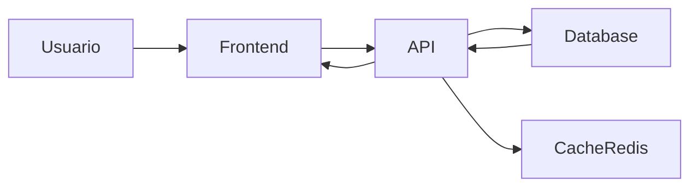

# Arquitetura Simples do MarketDash

## 1. Visao geral
Arquitetura em camadas com frontend React consumindo uma API FastAPI. O backend persiste dados em PostgreSQL (Supabase) e executa o processamento de CSV e agregacoes analiticas.

## 2. Componentes principais
- **Frontend (React + Vite)**: UI, filtros, dashboards e exportacao.
- **Backend (FastAPI)**: autenticao, ingestao de dados, KPIs e relatorios.
- **Banco de dados (PostgreSQL/Supabase)**: armazenamento relacional.
- **Servidor/Infra**: containers Docker, proxy e deploy.

## 3. Fluxo basico
1. Usuario faz login no frontend.
2. Frontend chama API para autenticar e obter token.
3. Usuario envia CSV ou dados de ad spends.
4. Backend valida, processa e grava no banco.
5. Frontend consulta KPIs e graficos via API.

## 4. Diagrama simples

## 5. Backend em camadas
- **Routes**: expõe endpoints REST.
- **Services**: logica de negocio e agregacoes.
- **Repositories**: acesso ao banco.
- **Models/Schemas**: definicao de dados e validacao.

## 6. Frontend por features
- **features/**: auth, dashboard, landing.
- **shared/**: componentes e utilitarios.
- **core/**: configuracoes da aplicacao.

## 7. Banco e indices
Tabelas principais:
- users, datasets, dataset_rows, ad_spends, subscriptions.

Indices para consultas frequentes:
- user_id, date, product e combinacoes com user_id.

## 8. Seguranca
- JWT para autenticacao.
- Isolamento de dados por usuario.
- Validacao de inputs com Pydantic.

## 9. Observacoes de deploy
- Containers com Docker e Docker Compose.
- Proxy e dominios configurados via ambiente.
